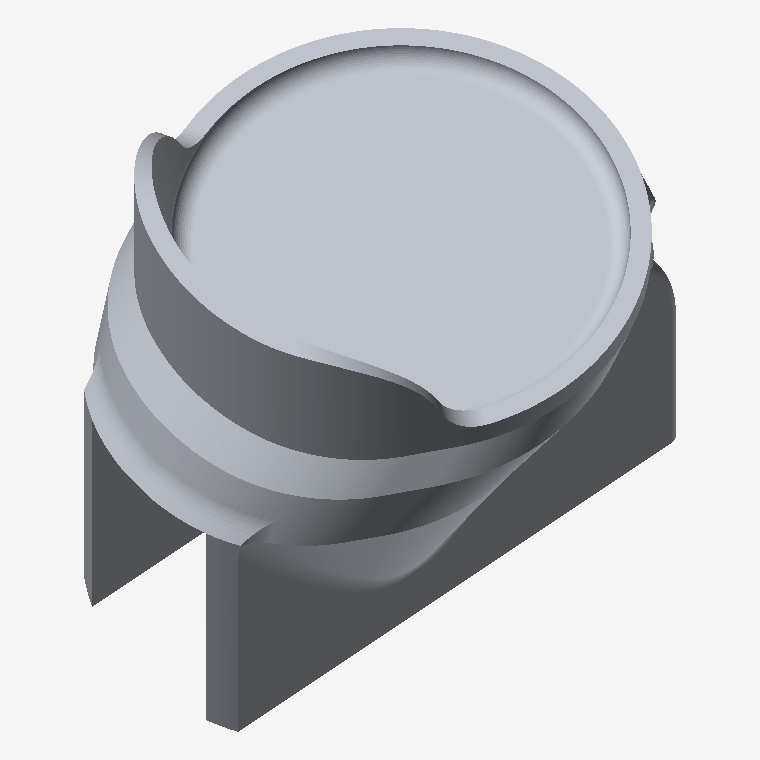

# Cup holder — 43 mm base, shifted 8 mm forward



A re-cut of the dosing-cup cradle that moves the cup **8 mm forward** (toward the
screw holes) and optionally tightens the base pocket to suit a **43 mm** cup base.

## Why

On my grinder the cup sits far enough back that it touches the rear wall of the
grinder body. That contact loads the cup against something other than the scale
and shows up as noise on the load cell. Moving the cup forward removes the
contact, and as a side effect shortens the moment arm from the screw line to the
cup axis (22.75 mm → 14.75 mm), which also helps the reading settle.

## ⚠️ This is not derived from `3d_files/58mm Cup holder.stl`

The baseline here is my own STEP export from the project's Fusion design
(`PRODUCT('smart-grind-by-weight. Eureka Mignon')`), and it is **a different part**
from the `58mm Cup holder.stl` committed at the top level of `3d_files/`:

|                  | `58mm Cup holder.stl` | baseline used here |
| ---------------- | --------------------- | ------------------ |
| volume           | 26.77 cm³             | 40.67 cm³          |
| size (X×Y×Z)     | 49.00 × 56.20 × 38.70 | 49.33 × 59.41 × 55.97 |
| mount            | screw tab on the side | bottom plate, 2× Ø4.0 counterbored from below |
| backstop         | none                  | saddle-shaped, +Y side |

So treat these files as a **new variant**, not a drop-in replacement. The exact
baseline is committed under `source/` so the result is reproducible.

## Files

| file | pocket Ø | fit on a 43.0 mm base | ledge OD | max width | volume |
| ---- | -------- | --------------------- | -------- | --------- | ------ |
| `Cup holder - 43mm base, 8mm forward.stl` | 43.500 | 0.25 mm/side, seats on the fillet ring 1.03 mm above the floor | 47.500 | 48.14 | 39.80 cm³ |
| `Cup holder - 43mm base, 8mm forward (loose fit).stl` | 44.000 | 0.50 mm/side | 48.000 | 48.47 | 40.04 cm³ |
| `Cup holder - stock pocket, 8mm forward.stl` | 45.329 (unchanged) | 1.16 mm/side, drops to 0.18 mm above the floor | 49.328 (unchanged) | 49.33 | 40.67 cm³ |

**Start with the 43.50 file.** A 43 mm base already fits the stock 45.33 pocket,
but with 1.16 mm of play per side the cup can shift and rock — which is working
against the load cell. At 43.50 the base rests on the R2 fillet ring and
self-centres to 0.25 mm.

If it binds, use the 44.00 version. FDM holes typically come out 0.1–0.4 mm
undersize, so 0.25 mm/side is genuinely tight. The stock-pocket file is the
conservative option: forward shift only, pocket untouched.

## What is identical to the baseline

- **Screw holes.** Ø6.500 counterbores and Ø4.000 through-holes at
  (±3.5, −138.0000), verified bit-identical.
- **The whole mount.** All 11,295 baseline triangles lying fully below the
  z = −167 freeze line are present verbatim; mount plate, side rails and every
  mating face are untouched.
- **Overall height**, z = −197.5 … −141.53.
- **Backstop wall thickness and draft.** Inner and outer backstop faces both move
  by the same radial offset at every height, so the 2 mm wall and the 8.74° draft
  are preserved, not approximated.

## What changed

- Cup axis y = −115.25 → **−123.25** (8 mm toward the screws).
- Pocket Ø45.329 → **Ø43.500** (in the recommended file); floor Ø41.329 → Ø39.500.
- Rear-most point of the part −88.59 → −91.00, so the part itself also gains
  2.4 mm of clearance from the grinder wall while the cup gains the full 8 mm.

## Printing

Same orientation and settings as the stock cup holder. Two things to know:

- Unsupported downward-facing area (past 45°) goes **28.7% → 32.2%** in the
  z −172…−140 band, from the forward lean. That zone already needed support.
- The ramp from the mount to the cradle is deliberately **linear rather than
  smoothed**, which caps the new front flare at ~34° from vertical instead of
  ~52°. The tradeoff is faint tangent creases at z = −167 and z = −157; they are
  cosmetic.

All three meshes are watertight: 87,890 triangles, 0 non-manifold edges,
0 degenerate triangles.

## Regenerating

`remodel.py` needs only numpy and reads `source/Cup holder (baseline export).stl`:

```bash
python3 remodel.py 43.5 8.0 "Cup holder - 43mm base, 8mm forward.stl"
python3 remodel.py <pocket_dia_mm> <forward_shift_mm> <output.stl>
```

It prints the resulting pocket diameter, the cup-axis position, where a flat base
will seat, watertightness checks and the before/after bounding box. Tune
`Z_RAMP_LO` / `Z_RAMP_HI` at the top of the file to move the blend band.

### How it works

The cradle-to-pedestal transition in the STEP is 26 B-spline blend surfaces, so
editing the STEP directly would break tangency, and rebuilding the saddle-shaped
backstop from scratch loses fidelity. Instead the cradle is offset **radially**
about the cup axis and then translated, because a constant radial offset maps
every analytic feature of the cradle exactly:

```
cylinder  r -> r + dr          cone   r -> r + dr  (at constant z)
torus     R -> R + dr          planes unchanged
```

The offset is ramped to zero between z = −157 and z = −167, so the mount below is
untouched. The mesh is conformally refined first — split decisions are made per
*edge*, so adjacent triangles always agree and no cracks or T-junctions appear —
and edges at or below the freeze line are never re-tessellated, which is what
keeps the mount bit-identical.

Because the map preserves z and is monotone in radius, it is injective on every
z-slice and therefore cannot fold the surface onto itself.
