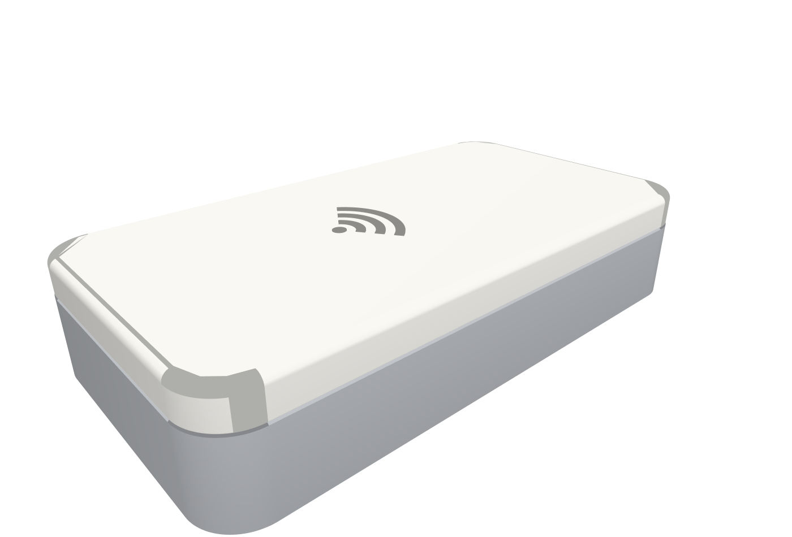
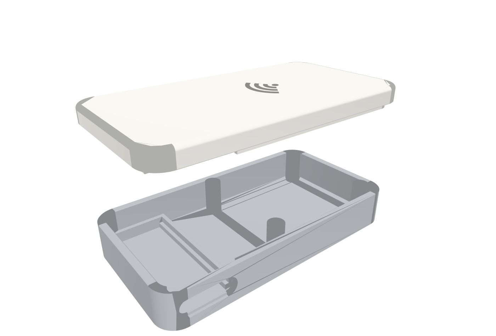
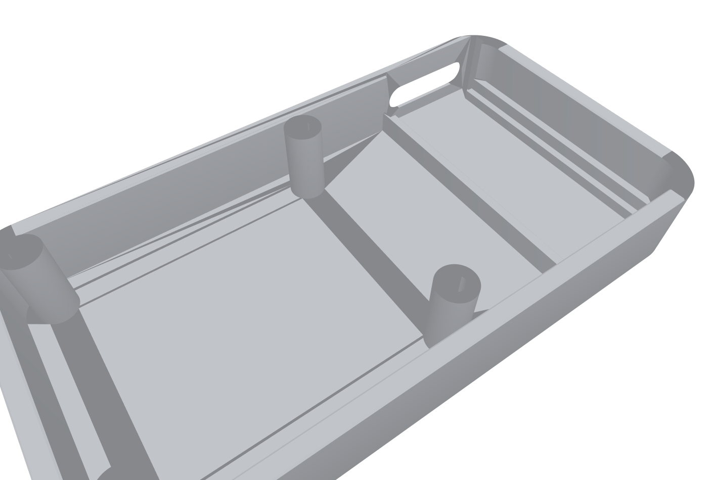
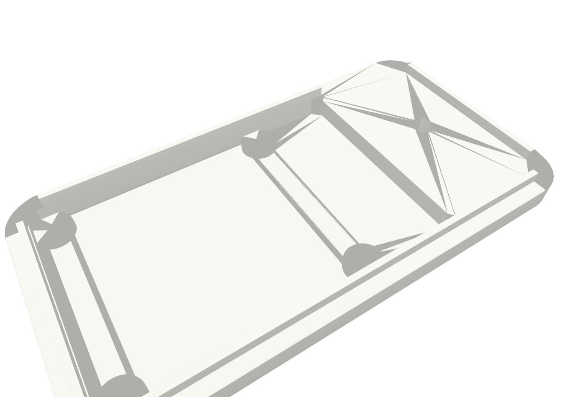
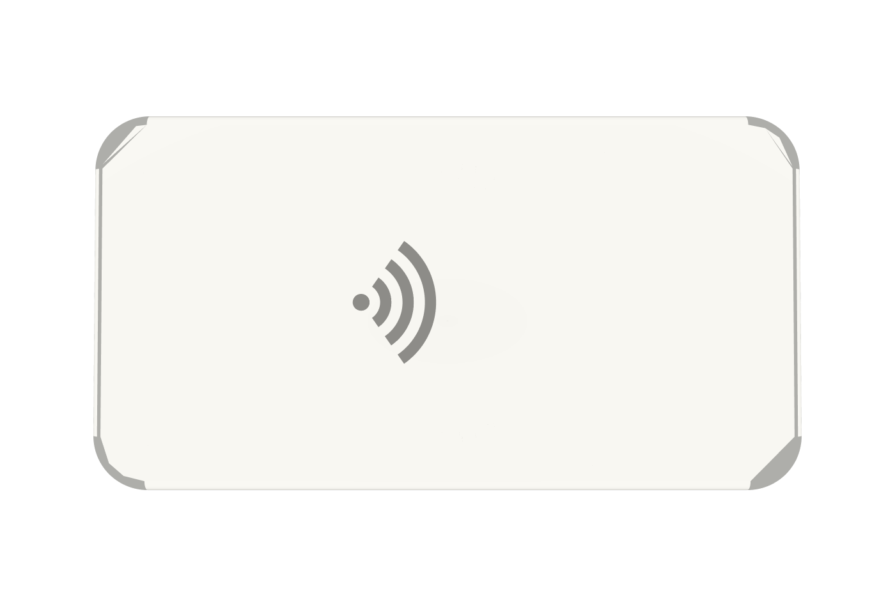

# MATTR Labs Verifier — CNC Enclosure (rev A)

> **Note on location:** these files belong in `verifier-peripheral/enclosure/cnc/`.
> They are committed here because this session's working branch targets this
> repository — copy the whole `verifier-cnc-enclosure/` directory across.

A two-part, two-material CNC-machined enclosure for the verifier peripheral
(ESP32-C6 devkit + NXP PN7160 NFC board). The entire top face is the NFC tap
surface. The QR module is intentionally out of scope for this revision.



## Design intent

The reference is the Apple MagSafe charging puck: **machined aluminium
wherever the radio doesn't care, machined polymer exactly where it does.**
NFC (13.56 MHz) will not couple through metal, so the one surface the user
touches — the top — is a single slab of frosted polycarbonate, and everything
below it is a 6061 aluminium unibody. The material split *is* the design: a
white tap surface floating on a bead-blasted aluminium base, separated by a
0.3 mm shadow-line reveal, with no visible fasteners from any normal viewing
angle.

| | |
|---|---|
| Outer envelope | **128 × 68 × 27 mm**, R10 corners |
| Mass (est.) | ~200 g assembled — sits planted, feels dense |
| Tap surface | full top face; antenna sits 4.6 mm below it (2.5 mm PC + air gap) |
| Fasteners | 4 × M3×22, entering from the underside, invisible in use |
| Ports | single USB-C slot, rear face, chamfered recess |
| Status light | WS2812 glows through a 1.2 mm hidden light window — invisible when off |



## How it works

**Chassis (6061-T6 aluminium, machined from solid).** The floor carries the
ESP32-C6 devkit between two integral rails with support ledges (solder tails
hang in the channel between them) and an end-stop rib that takes USB
insertion loads. Four Ø8 integral posts rise past the wall rim and carry the
PN7160 board face-up, so the antenna is presented to the underside of the top
plate at a machine-controlled distance. The rear wall is locally thinned to
2.0 mm behind the USB ports so any cable overmold reaches the connector.

**Top plate (polycarbonate, machined from 10 mm stock faced to 8.0 mm).**
The underside is pocketed over the NFC board, leaving a 2.5 mm membrane —
the tap surface. A perimeter register lip keys into the cavity for a
seam-free fit. Four bosses inside the pocket seat on the NFC board around
its mounting holes. A Ø6 blind pocket over the devkit's WS2812 leaves 1.2 mm
of material: the LED reads as a soft glowing dot through the frosted PC and
disappears entirely when off. The contactless icon is engraved 0.3 mm into
the top face, centred over the antenna.

**One fastener axis, three jobs.** Each M3×22 enters through a counterbore
in the base, rides up the bore of an NFC post, passes through the PN7160
mounting hole, and threads into the plate boss above it. Four screws clamp
plate → board → chassis in a single stack. Torque to 0.35 N·m (threads are
in polycarbonate). An optional die-cut adhesive bottom pad (0.8 mm PU or
microfibre) hides even those four screws.





## RF notes (read before changing geometry)

- The aluminium floor sits ~12 mm below the antenna plane and the walls are
  ≥6 mm away laterally from the board edge. Metal near a loop antenna
  detunes it: after first assembly, **re-run PN7160 antenna tuning** (the
  chip's Dynamic Power Control expects the final housing).
- If read range disappoints, add a 0.1–0.2 mm ferrite sheet under the
  antenna area of the PN7160 board — do not thin the membrane further.
- Never substitute the top plate in metal, metallic paint, or carbon-filled
  polymer. Bead-blasted PC or natural POM only.
- The devkit (and its BLE chip antenna) lives beside — not under — the NFC
  board. Keep it that way in any layout change.

## Assembly requirement: low-profile harness

The internal height budget assumes **no vertical DuPont jumpers on the
devkit**. Solder the interconnect (I2C, IRQ, VEN, DWL, 5 V, GND) directly to
the devkit pads, or use pre-crimped wires dressed sideways; keep the loom
within 8 mm above the devkit PCB. On the PN7160 side there is ~9 mm below
the board — right-angle or direct-soldered connections there too. Wires
route through the 3 mm channel between the two bays.

Factory reset without opening the box: not provided by design (no pinhole —
the top stays clean). Use the GPIO 5 bridge or reflash; opening is four
screws.

## Files

| Path | What |
|---|---|
| `build_enclosure.py` | **Single source of truth.** All parameters + tolerance-stack asserts. |
| `step/verifier-chassis.step` | Chassis, send to shop |
| `step/verifier-top-plate.step` | Top plate (includes engraved icon), send to shop |
| `step/verifier-assembly.step` | Assembly with board mockups, for orientation |
| `stl/*.stl` | Quick-look meshes only (the plate STL omits the engraving — OCC tessellation bug; the STEP carries it) |
| `previews/*.png` | Renders (regenerate with `render_previews.py`) |
| `MANUFACTURING.md` | Materials, setups, tolerances, finishing, BOM, assembly |

Regenerate everything:

```bash
pip install cadquery numpy-stl plotly kaleido
python3 build_enclosure.py
python3 render_previews.py
```

## Known follow-ups for rev B

- Confirm the WS2812 position on the actual ICBBuy devkit and set `LED_POS`
  (the window is currently at the devkit's geometric centre).
- Confirm PN7160 antenna coil location; nudge `ICON_CENTER` onto it if the
  coil is offset on the board.
- QR module re-entry: the right bay and rear wall have room for a second
  window revision; the parametric layout makes the stretch trivial.
