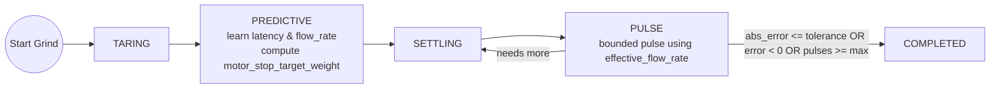
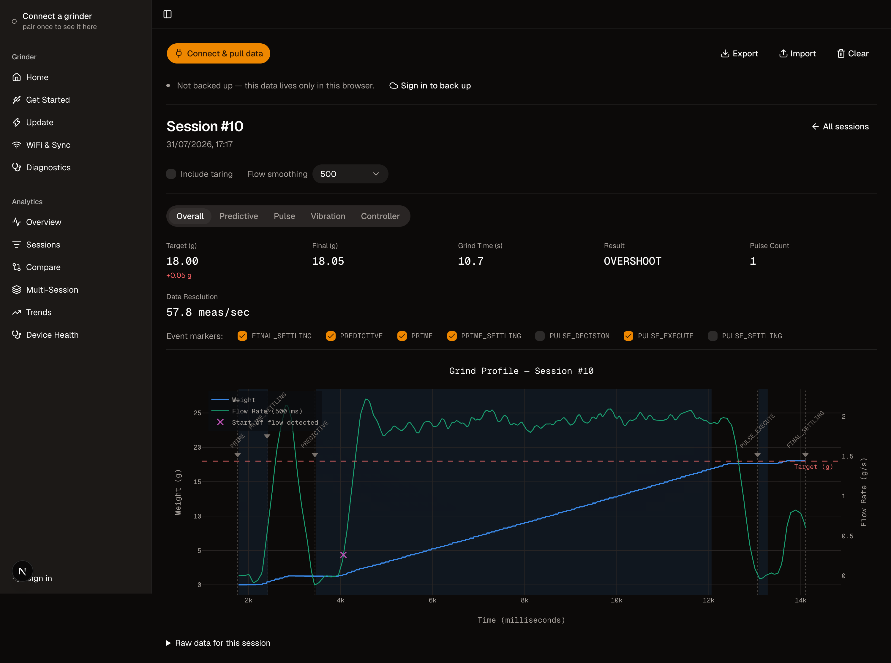

# Smart Grind-by-Weight

> **This is a fork of [jaapp/smart-grind-by-weight](https://github.com/jaapp/smart-grind-by-weight).**
> The original hardware design, firmware, and grinding algorithm are the work of **[Jaap (@jaapp)](https://github.com/jaapp)**.
> This fork is maintained by [@preetpatel](https://github.com/preetpatel) and has diverged since February 2026 —
> see [What's different in this fork](#-whats-different-in-this-fork).
> **Issues and support for this fork belong here, not upstream.**

**Turn any grinder into a precision smart grind-by-weight system**

<table>
<tr>
<td width="50%">

https://github.com/user-attachments/assets/e20ce3e2-417e-4a3b-bb48-05591fce9418


</td>
<td width="50%">

[](media/smart-grind-by-weight-render.PNG)

</td>
</tr>
</table>

> **⚠️ Experimental Mod - Buyer Beware!**
> This is a **grinder modification project** that requires technical skill to build and may have rough edges. **Build at your own risk!**

The Smart Grind-by-Weight is a user-friendly, touch interface-driven, highly accurate open source grinder modification that transforms any grinder (with an accessible motor relay) into an intelligent grind-by-weight system. It was originally developed by Jaap for the Eureka Mignon Specialita, and can be adapted for other grinders.

**The concept is simple:** Perform a "brain swap" on your grinder. Replace the original controller with an ESP32-S3 controller and add a precision load cell to the mix.

**Upgrade cost:** €30-40 in parts
**Target accuracy:** ±0.03g tolerance
**No regrets:** No permanent modifications, and original grind-by-time mode is also available

---

## ✨ Features

- **User-friendly interface** with 3 profiles: Single, Double, Custom
- **Beautiful display** with simple graphics or detailed charts (easily switchable)
- **High accuracy**: ±0.03g error tolerance
- **Zero-shot learning**: Algorithm adapts instantly to any grind size, bean setting, humidity etc. without manual tuning
- **Original timed run preserved** – there is a setting to enable the original Grind-By-Time mode
- **BLE OTA updates** for firmware
- **Advanced analytics** using BLE data transfer and Python Streamlit reports
- **On-device diagnostics** for calibration, load cell wiring, and mechanical instability faults
- **For Eureka**: No permanent modifications needed - just swap the screen and add 3D printed parts

---

## 🧠 Intelligent Grinding Algorithm

The predictive grinding system uses a zero-shot learning approach that adapts to any conditions:



**Key Innovation:** The algorithm learns grind latency and flow rate in real-time, then uses predictive control to stop just before the target weight, followed by precision pulses to reach exact accuracy. No manual tuning required.

---

## 🔀 What's different in this fork

This fork tracks upstream's hardware design and core algorithm, and adds reliability, diagnostics, and tooling work:

**Accuracy & motor control**
- Exact, deterministic motor pulses; pulse completion detected without polling the RMT driver
- 0.1s minimum pulse floor and preserved flow/calibration accuracy across grinds
- Tare and calibration failures now surface to the user instead of failing silently
- Correct auto-tune cancellation and failure reporting

**Diagnostics & device health**
- `LOAD_CELL_SATURATED` detection — catches A+/A- load cell wiring faults and blocks weight-mode grinds
- Internal and PSRAM heap census at startup and in the heartbeat, reported over BLE
- Per-task stack headroom in task heartbeats
- `grinder.py analyze` pulls grind data, system info, and diagnostics over one BLE connection into a **Device Health** dashboard view

**Grinding UX**
- Post-completion top-up pulses in **weight** mode (previously time mode only), with live weight and arc updates

**Stability & performance**
- BLE stack survives Bluetooth toggles instead of wedging
- LVGL heap allocated from PSRAM rather than internal DRAM; reduced per-frame heap churn and a fixed style leak
- LVGL pinned to 9.3.0 to match `lv_conf.h`

**Tooling & hardware**
- Host-side C++ regression tests, run by the build tool and in CI
- Forward-shifted cup holder variant for 43 mm cup bases

Full history is in the [commit log](https://github.com/preetpatel/smart-grind-by-weight/commits/main) and [Releases](https://github.com/preetpatel/smart-grind-by-weight/releases).

---

## 🚀 Quick Start

### For Users - Using Pre-built Firmware

1. **Get the parts** - ESP32-S3 AMOLED display + HX711 + load cell (~€35 total) → See [Parts List](docs/DOC.md#-parts-list)
2. **3D print the mounting parts** - All STL files included, no supports needed → See [3D Printed Parts](docs/DOC.md#3d-printed-parts) | [Community Designs](docs/3D_PRINTS.md)
3. **Flash firmware & calibrate** - [Web Flasher](https://preetpatel.github.io/smart-grind-by-weight) (Chrome/Edge desktop + Android only) or command line
4. **Follow the assembly video** - [Complete Eureka build process](https://youtu.be/-kfKjiwJsGM) (by Jaap, for the original build)

**Ready to build?** → See **[DOC.md](docs/DOC.md)** for complete build instructions, parts list, and usage guide.

---

### For Developers - Building from Source

If you want to modify the code or contribute, see **[DEVELOPMENT.md](docs/DEVELOPMENT.md)** for build instructions.

**Design Files:** The complete Fusion 360 design is available at `3d_files/smart-grind-by-weight. Eureka Mignon.f3z` for modification and adaptation to other grinder models.

---

## 📊 Analytics Dashboard

[](media/analytics.png)

Pull everything from the grinder over one BLE connection — grind data, system info, and the diagnostics report — and analyze it right in your browser: the [Web Flasher](https://preetpatel.github.io/smart-grind-by-weight)'s **Analytics** tab connects over Web Bluetooth (Chrome/Edge), no local tools needed. Single-session phase charts, vibration/FFT analysis, multi-session statistics, and a Device Health view, with JSON export/import for sharing datasets.

Prefer working locally? The same pull and dashboard are available via the Streamlit tooling:

```bash
python3 tools/grinder.py analyze
```

Track accuracy, flow rates, grind times, and optimize your coffee workflow with detailed session analytics. The dashboard's **Device Health** view shows the firmware, memory, task performance, and diagnostics snapshot captured during the pull.

---

## 🙏 Attribution & Credits

**This project is a fork.** Nearly all of the hardware design, the mechanical parts, the predictive grinding algorithm, the LVGL interface, and the original firmware were built by **[Jaap (@jaapp)](https://github.com/jaapp)** in [jaapp/smart-grind-by-weight](https://github.com/jaapp/smart-grind-by-weight). If this project is useful to you, that's largely his work — please star the upstream repo.

On releasing the original project, Jaap wrote:

> My goal with this project was to get real-life experience coding with AI agents. The code reflects that learning journey. [...] "Vibe coding" with AI is great for POCs and testing theories. But afterward you must pivot and reimplement features while keeping a close eye on the architecture the AI produces. Otherwise you'll get stuck at dead ends that require painful refactoring.
>
> I'm very happy with the end result and I'm releasing the project as is. It eliminates grind weight variability from the espresso equation, bringing you one step closer to dialing in perfect shots.

Jaap has noted he has **limited availability for support** on the original project. Please don't file this fork's issues upstream — use [this repo's issue tracker](https://github.com/preetpatel/smart-grind-by-weight/issues).

The original project was in turn inspired by and builds upon:

- **[openGBW](https://github.com/jb-xyz/openGBW)** by jb-xyz - Open source grind-by-weight system
- **[Coffee Grinder Smart Scale](https://besson.co/projects/coffee-grinder-smart-scale)** by Besson - Smart scale integration concepts

Community 3D print designs are credited individually in [3D_PRINTS.md](docs/3D_PRINTS.md). Grinder compatibility reports link to upstream discussions, where that conversation lives.

---

## 📄 License

- **Software** — [GNU General Public License v3.0](LICENSE) or later
- **Hardware designs** — [CERN Open Hardware Licence v2 - Strongly Reciprocal](LICENSE) (CERN-OHL-S v2)

This fork is a modified version of the original work and is distributed under the same terms. Copyright is held jointly by the original Grind-by-Weight contributors and the contributors to this fork — see [LICENSE](LICENSE) for full terms and third-party component licenses.

---

## 📌 Project Status

This fork is maintained on a best-effort basis alongside a day job. It is shared **as-is** — expect limited support, and understand that this is an experimental modification to a mains-powered appliance that you are building and installing at your own risk.

**Want to dive deeper?** → Check out **[DOC.md](docs/DOC.md)** for comprehensive documentation.

**Different grinder?** → See **[Grinder Compatibility Matrix](docs/GRINDER_COMPATIBILITY.md)** for adaptation guidance.

**Having issues?** → See **[TROUBLESHOOTING.md](docs/TROUBLESHOOTING.md)** for common problems and solutions.

**Changelog & Updates** → See **[Releases](https://github.com/preetpatel/smart-grind-by-weight/releases)** for version history and updates.
